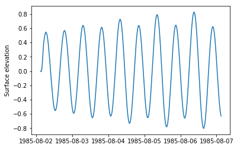

# mikeio: input/output of MIKE files in python

Facilitate creating, reading and writing dfs0, dfs2, dfs1 and dfs3, dfsu and mesh files. Reading Res1D data.

## Requirements

* Python x64 >=3.6
* [MIKE](https://www.mikepoweredbydhi.com/mike-2020) or [MIKE SDK](https://www.mikepoweredbydhi.com/download/mike-2020/mike-sdk)

## Installation

From PyPI:

`pip install mikeio`

Or development version:

`pip install https://github.com/DHI/mikeio/archive/master.zip`


## Examples

### Reading data from dfs0, dfs1, dfs2, dfsu


```python
>>> import mikeio
>>> ds = mikeio.read("random.dfs0")
>>> ds
DataSet(data, time, names)
Number of items: 2
Shape: (1000,)
2017-01-01 00:00:00 - 2017-07-28 03:00:00

>>> ds = mikeio.read("random.dfs1")
>>> ds
DataSet(data, time, names)
Number of items: 1
Shape: (100, 3)
2012-01-01 00:00:00 - 2012-01-01 00:19:48
```

### Reading dfs0 file into Pandas DataFrame
```python
from mikeio.dfs0 import dfs0
dfs = dfs0()
ts = dfs.read_to_pandas('simple.dfs0')
```

### Create simple timeseries
```python
from datetime import datetime, timedelta
import numpy as np
from mikeio.dfs0 import dfs0

# create a list containing data for each item
data = []

# Some random values for first (and only) item
d = np.random.random([100])
data.append(d)

dfs = dfs0()
dfs.create(filename='simple.dfs0',
           data=data,
           start_time=datetime(2017, 1, 1),
           dt=60)

```


### Create equidistant dfs0 with weekly timestep
```python
from mikeio.eum import TimeStep
d1 = np.random.random([1000])
d2 = np.random.random([1000])
data = []
data.append(d1)
data.append(d2)

dfs = dfs0.dfs0()
dfs.create(filename='random.dfs0',
           data=data,
           start_time=datetime(2017, 1, 1),
           timeseries_unit=TimeStep.DAY,
           dt=7,
           names=['Random1', 'Random2'],
           title='Hello Test')

```
For more examples on timeseries data see this [notebook](notebooks/01%20-%20Timeseries.ipynb)


### Read dfs2 data
```python
from mikeio.dfs2 import dfs2
dfs2File = r"20150101-DMI-L4UHfnd-NSEABALTIC-v01-fv01-DMI_OI.dfs2"
dfs = dfs2()
res = dfs.read(dfs2File)
res.names
```

### Create dfs2
For a complete example of conversion from netcdf to dfs2 see this [notebook](notebooks/Sea%20surface%20temperature%20-%20dfs2.ipynb).

Another [example](notebooks/Global%20Forecasting%20System%20-%20dfs2.ipynb) of downloading meteorlogical forecast from the Global Forecasting System and converting it to a dfs2 ready to be used by a MIKE 21 model.


### Read Res1D file Return Pandas DataFrame
```python
import res1d as r1d
p1 = r1d.ExtractionPoint()
p1.BranchName  = 'branch1'
p1.Chainage = 10.11
p1.VariableType  = 'Discharge'
ts = r1d.read('res1dfile.res1d', [p1])
```

### Read dfsu files
```python
import matplotlib.pyplot as plt
from mikeio.dfsu import dfsu

dfs = dfsu()

filename = "HD.dfsu"
res = dfs.read(filename)

idx = dfs.find_closest_element_index(x=608000, y=6907000)

# data has two dimensions time, x
plt.plot(res.time, res.data[0][:,idx])
```


## Misc utilities
 to query variable type, time series types (useful when creating a new dfs file)
```python
>>> from mikeio.dfs_util import type_list, unit_list
>>> type_list('Water level')
{100000: 'Water Level', 100307: 'Water level change'}

>>> unit_list(100307)
{1000: 'meter', 1003: 'feet'}
```
